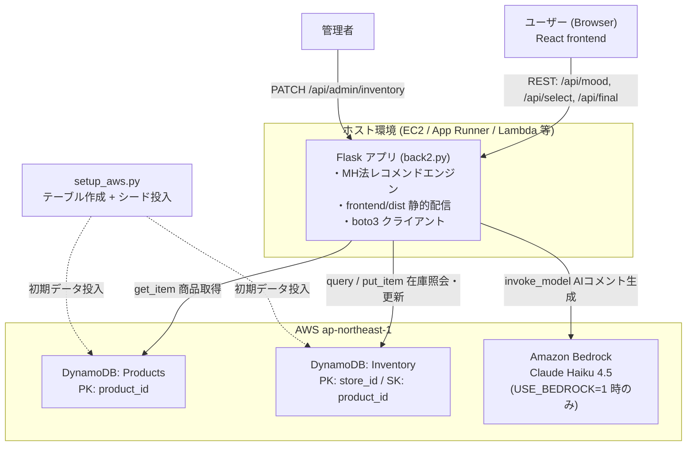
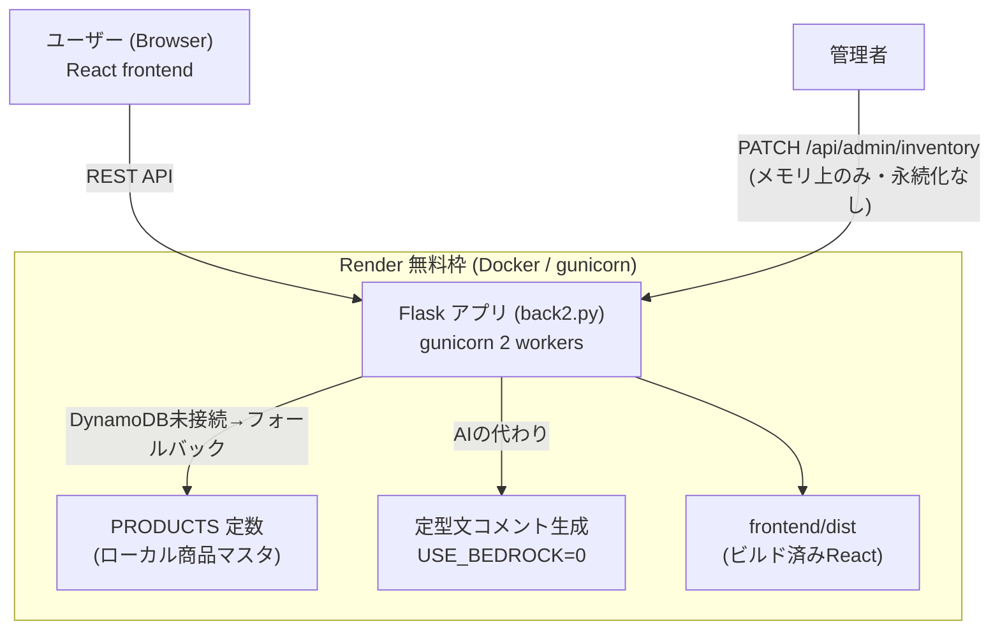

# コンビニ在庫連動レコメンドアプリ

気分タグから商品を提案し、選択を繰り返してユーザーにぴったりの一品をレコメンドするアプリ。
レコメンドはMH法（メトロポリス・ヘイスティングス法）でユーザーベクトルに近い商品を抽出する。

- フロントエンド: React (Vite)
- バックエンド: Flask (`backend/back2.py`)
- バックエンドの起動手順は [backend/README.md](backend/README.md) を参照

## アーキテクチャ

このアプリは **AWSあり / なしの2構成** で動作する。コードは同一で、環境変数とAWS認証情報の有無だけで切り替わる。
バックエンドはDynamoDBへの接続に失敗すると自動でローカルデータにフォールバックするため、AWSなしでもそのまま動く。

### ① AWS利用版

商品マスタ・在庫をDynamoDBで管理し、レコメンド理由をBedrock（Claude Haiku 4.5）で生成する本番構成。



**セットアップ:**

```bash
# AWS認証情報を設定したうえで
python backend/setup_aws.py   # DynamoDBテーブル作成＋シードデータ投入
export USE_BEDROCK=1          # AIコメント生成を有効化（Windows: set USE_BEDROCK=1）
python backend/back2.py
```

### ② AWS不使用版（無料ホスティング構成）

Render無料枠（Docker + gunicorn）で動かすデモ向け構成。
AWSの3サービスがすべてアプリ内部に置き換わる。設定は [render.yaml](render.yaml) と [Dockerfile](Dockerfile) を参照。



> **注意:** AWS不使用版では在庫更新（`/api/admin/inventory`）が永続化されない。
> DynamoDB未接続のためメモリ上のみで、再起動すると初期化される。デモ用途向け。

### AWSあり / なしの対応表

| 役割 | AWS利用版 | AWS不使用版 |
|---|---|---|
| 商品マスタ | DynamoDB `Products` | `PRODUCTS` 定数（`backend/back2.py`） |
| 在庫管理 | DynamoDB `Inventory` | メモリ上のみ・**再起動で消える** |
| AIコメント | Bedrock (Claude Haiku 4.5) | 定型文 |
| 実行環境 | EC2 / App Runner / Lambda 等 | Render 無料枠（Docker + gunicorn） |
| 切替スイッチ | `USE_BEDROCK=1` + AWS認証情報 | `USE_BEDROCK=0`（既定） |

## APIエンドポイント一覧

| パス | メソッド | 誰が使う | 何をする |
|---|---|---|---|
| `/api/mood` | POST | ユーザー | 気分タグ → 候補3件 |
| `/api/select` | POST | ユーザー | 商品選択 → 次の候補 or 終了 |
| `/api/final` | POST | ユーザー | 最終レコメンド |
| `/api/admin/inventory` | PATCH | 管理者のみ | 在庫数を更新 |
